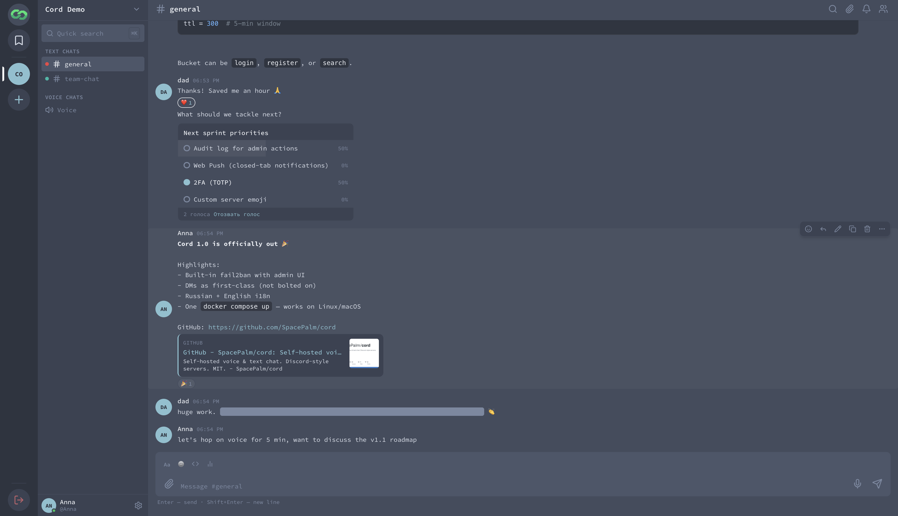
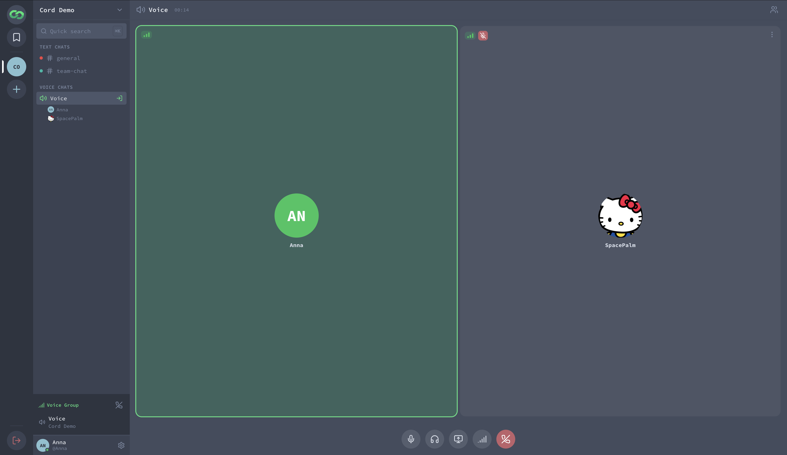
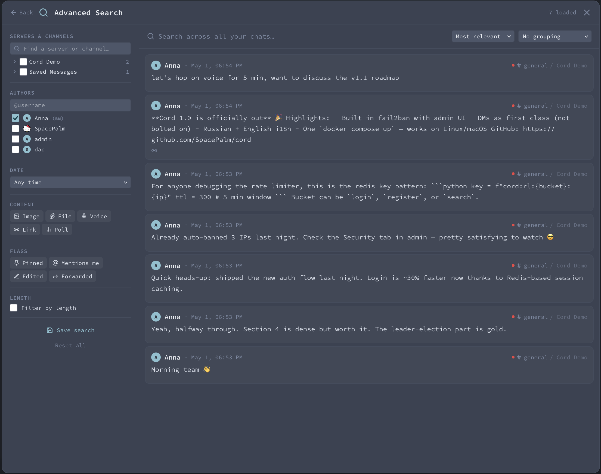
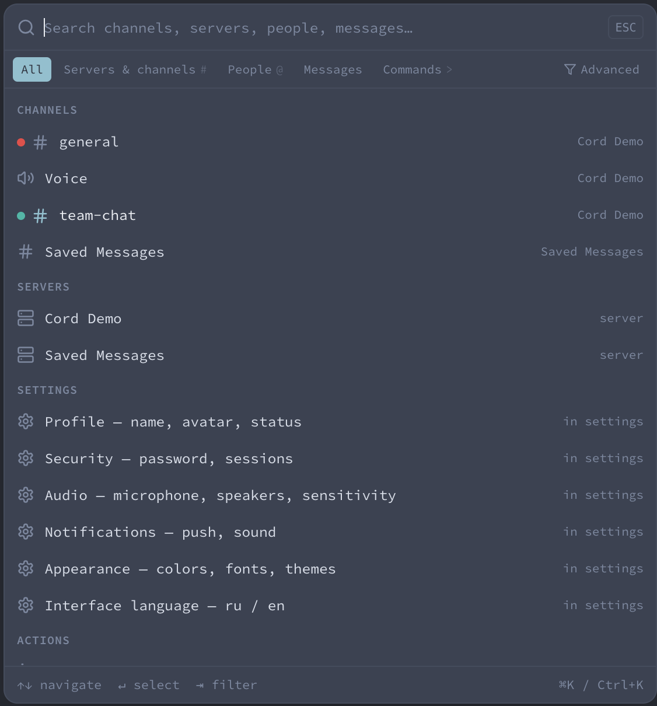
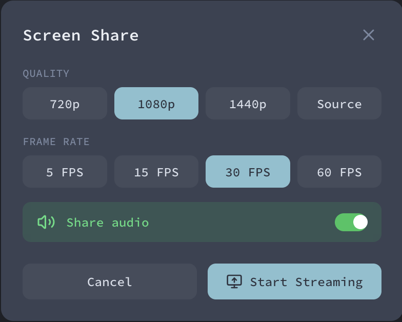
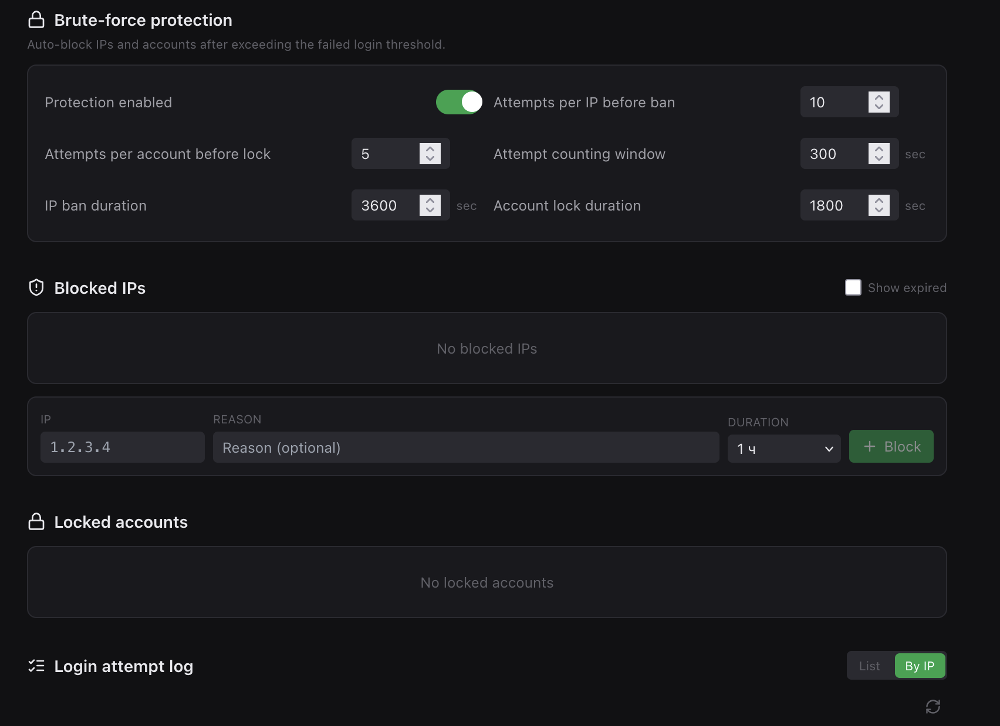
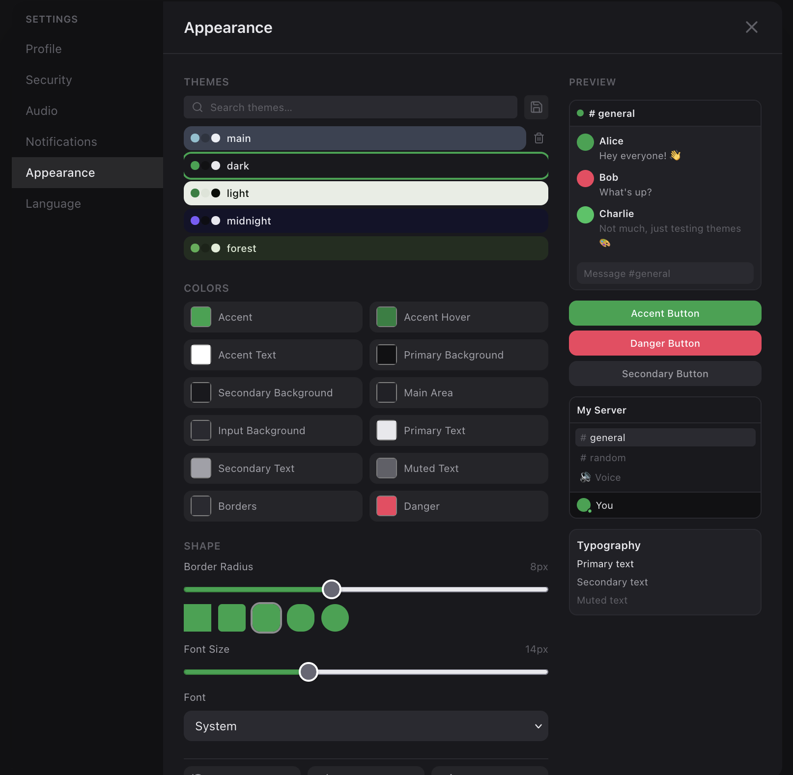

<p align="center">
  
</p>

<h1 align="center">Cord</h1>

<p align="center">
  Open-source voice & text chat platform — self-hosted Discord alternative.<br/>
  Built with FastAPI, React, LiveKit, PostgreSQL, and Redis.
</p>

<p align="center">
  
</p>

<p align="center"><b>Voice rooms</b> — LiveKit-powered, active-speaker highlight, per-user volume, screen sharing</p>
<p align="center">
  
</p>

<p align="center"><b>Advanced search</b> — cross-server full-text search with filters by author, date, content type, flags</p>
<p align="center">
  
</p>

<details>
<summary><b>More screenshots</b></summary>

<p align="center"><b>Command palette</b> (<code>Ctrl/Cmd + K</code>) — jump to any channel, server, person, message, or settings tab in one keystroke</p>
<p align="center">
  
</p>

<p align="center"><b>Screen sharing</b> — pick quality (720p–1440p), framerate (5–60 FPS), and toggle system audio capture</p>
<p align="center">
  
</p>

<p align="center"><b>Built-in brute-force protection</b> — auto-ban IPs and lock accounts on failed-login thresholds, manual blocks with custom durations, attempt log grouped by IP</p>
<p align="center">
  
</p>

<p align="center"><b>Themes</b> — 14 built-in presets, full color customization, 22 fonts, live preview</p>
<p align="center">
  
</p>

</details>

---

## Table of Contents

- [Features](#features)
- [Architecture](#architecture)
- [Ports](#ports)
- [Tech Stack](#tech-stack)
- [Quick Start](#quick-start)
- [Configuration](#configuration)
- [Deployment](#deployment)
- [Administration](#administration)
- [User Guide](#user-guide)
- [Command Palette](#command-palette)
- [Direct Messages](#direct-messages)
- [Search](#search)
- [Notifications](#notifications)
- [API Reference](#api-reference)
- [Database Schema](#database-schema)
- [Caching (Redis)](#caching-redis)
- [Security](#security)
- [Internationalization](#internationalization)
- [Theming](#theming)
- [Project Structure](#project-structure)
- [Adding a Language](#adding-a-language)
- [License](#license)

---

## Features

### Communication
- **Text Chats** — messages with markdown (`**bold**`, `*italic*`, `||spoiler||`), replies, forwards, file attachments, voice messages, reactions
- **Direct Messages** — private 1-to-1 conversations with text and voice calls; list with unread counts and last message preview
- **Saved Messages** — per-user personal space with multiple text channels for notes and bookmarks
- **Polls** — create polls with multiple options, one vote per user, real-time results
- **Voice Chats** — real-time audio via [LiveKit](https://livekit.io) WebRTC with mute/deafen controls
- **DM Calls** — 1-to-1 voice calls with incoming-call overlay, ringtone, accept/decline/cancel flow
- **Floating Call Widget** — draggable mini-window while browsing other chats; click to expand back into the full voice room
- **Screen Sharing** — configurable resolution (720p–1440p), FPS (5–60), system audio capture
- **Call Duration Timer** — shared conference timer synced via Redis, persists across reloads
- **Per-user Volume** — mute individual users, adjust volume 0–300%, per-user settings persist

### Social
- **Groups (Servers)** — create groups with text and voice chats, custom avatars
- **Members** — online status tracking with heartbeat (120s TTL), member list with avatars
- **Invite Links** — 24-hour expiring invite codes with shareable URLs
- **User Profiles** — custom avatars with image cropping, display names
- **Privacy-aware User Search** — find people by exact username only; existing contacts are fuzzy-searchable
- **Click-to-DM** — click any user's avatar/name anywhere to open chat or start a call

### Search
- **Global Message Search** — Postgres full-text search with Russian/English stemming, ranking by relevance
- **Per-chat Search** — search messages within a specific channel via the search panel
- **User Search** — find contacts with multi-word matching (`ivan petrov`), strangers by exact username
- **Match Highlighting** — search results highlight matching terms in previews with smart context snippets
- **Search History** — last 10 successful searches available in the command palette

### Command Palette
- **Global shortcut** `Ctrl+K` / `Cmd+K` or button in the channel sidebar
- **Navigate** to any server, channel, DM, or settings tab in a single keystroke
- **Search** channels, servers, people, messages from one prompt
- **Filter chips** or prefix shortcuts: `#` servers/channels, `@` people, `>` commands
- **Role-aware admin actions** — admin-only commands hidden for regular users
- **Disabled during active call** — admin-panel navigation is blocked while in a voice call (prevents accidental LiveKit disconnect)

### Notifications
- **OS-level Push** — desktop notifications with sender avatar, name, and message preview; click to jump to the chat
- **In-app Toasts** — slide-in banners in the top-right corner with the same rich content
- **Unread Badges** — per-chat, per-group, and per-DM counters update in real time via WebSocket
- **Notification Levels** — All / Mentions & DMs / DMs only / Off
- **Per-chat Mute** — bell icon 🔔 in chat headers to mute individual channels/DMs
- **Ringtone** — looping phone-style ring for incoming DM calls with separate volume control
- **Notification Sound** — short chime for new messages with independent volume slider
- **@Mention detection** — mentions are highlighted in notifications and marked as high-priority (persistent, not auto-dismissed)

### Message Actions
- **Hover Toolbar** — quick access to react, reply, edit (own), copy, delete, more menu
- **Right-click Context Menu** — full action menu anchored to cursor position with all operations
- **Forwarding** — forward single messages or bulk-forward multiple messages to any chat
- **Pin Messages** — pinned messages accessible via header panel
- **Reactions** — emoji reactions with aggregated counts and hover tooltips showing who reacted

### Customization
- **Theme Engine** — 10+ built-in presets (Dark, Light, Midnight, Forest, Dracula, Monokai Pro, Nord Aurora, Sakura, Ocean Depths, Sunset Ember, Cyberpunk, Cotton Candy, Rose Pine, Solarized Dark) + full color customization (11 colors)
- **Shape Controls** — adjustable border radius (0–20px) and font size (12–18px)
- **Font Customization** — 22 fonts from Google Fonts, loaded on demand
- **Theme Import/Export** — save and share themes as JSON files
- **Live Preview** — real-time theme preview panel in settings
- **Multi-language** — English and Russian, extensible; app uses browser-appropriate locale for dates

### Administration
- **User Management** — search, block/unblock, promote/demote admins, delete users
- **Group Management** — view all non-system groups (DM and personal groups are hidden)
- **System Settings** — toggle registration, view disk/DB statistics
- **Granular Cleanup** — delete old messages with independent toggles for including personal messages and direct messages
- **Brute-force Protection (fail2ban)** — auto-ban IPs and lock accounts after failed login thresholds, configurable from the admin panel
- **Login Attempt Log** — append-only audit log of all login attempts (success + fail), grouped by IP, showing which usernames were tried from which address
- **IP Blocking** — manual block/unblock of individual IPs (1h / 1d / 7d / 30d / permanent) from the log view or the blocked-list table; banned IPs are kicked from active sessions on the next API call

---

## Architecture

```
┌─────────────┐     ┌──────────────────┐     ┌──────────────┐
│   Browser    │────▶│  Frontend (nginx)│────▶│   Backend    │
│  (React SPA) │     │   container :80  │     │ (FastAPI:8000│
└─────────────┘     │   host: :8080    │     └──────┬───────┘
       │             └──────────────────┘            │
       │                       │                     │
       │  WebRTC (LiveKit)     │ proxies             ├──▶ PostgreSQL:5432
       │                       │ /api, /media, /ws   │
       ▼                       │                     ├──▶ Redis:6379
┌──────────────┐               │                     │
│   LiveKit    │◀──────────────┘─────────────────────┘
│  Server:7880 │    (token generation)
└──────────────┘
```

**Request flow:**
1. Browser loads the React SPA from the **frontend container's nginx** (host `:8080`, container `:80`)
2. Same nginx proxies `/api/*`, `/media/*`, `/ws` to the **backend** container (`backend:8000`) over the Docker network — no external reverse proxy required
3. Backend authenticates via short-lived JWT (15 min) + opaque refresh token (30 d, server-side session); queries PostgreSQL with full-text search (`tsvector` + GIN); caches hot data in Redis
4. Voice/video: backend generates a LiveKit JWT → browser connects directly to LiveKit server (`:7880`) via WebSocket/WebRTC
5. Real-time updates: browser keeps a persistent WebSocket `/ws` connection for message/typing/call events
6. Online status: browser sends heartbeat every 60s → backend writes to Redis with 120s TTL
7. For HTTPS in production, put a host-level nginx (or Caddy/Cloudflare) in front of `:8080`. See [Deployment](#deployment).

---

## Ports

All services expose the following ports. Make sure they are open on your firewall/server.

| Port | Protocol | Service | Required | Description |
|------|----------|---------|----------|-------------|
| **8080** | TCP | Frontend | Yes | Containerized nginx serving the SPA + proxying API/WS/media. Configurable via `FRONTEND_PORT`. With the TLS override the container also listens on 80/443 directly |
| **8000** | TCP | Backend | Internal | FastAPI server. In dev mapped to host for direct API access; in prod compose not exposed (frontend nginx proxies internally) |
| **7880** | TCP | LiveKit | Yes | WebSocket signaling for WebRTC. Must be accessible from browser (`LIVEKIT_PUBLIC_URL`) |
| **7881** | TCP | LiveKit | Yes | RTC media over TCP (fallback when UDP is blocked) |
| **7882** | UDP | LiveKit | Yes | RTC media over UDP (primary, lowest latency). **Must be open for voice/video to work** |
| **5432** | TCP | PostgreSQL | Internal | Database. Only needs to be exposed if you access DB from host (e.g. pgAdmin) |
| **6379** | TCP | Redis | Internal | Cache. Only needs to be exposed for debugging |

> **Internal** = only needs to be reachable between Docker containers (the default Docker network handles this).
>
> **Production with reverse proxy:** expose only 80/443 (HTTPS) and 7880-7882 (LiveKit). The reverse proxy handles TLS termination and routes `/api/*`, `/media/*` to the backend, everything else to the frontend build.

---

## Tech Stack

| Layer | Technology | Purpose |
|-------|-----------|---------|
| **Frontend** | React 18, TypeScript, Vite | UI framework and build tool |
| **Styling** | Tailwind CSS 3.4 | Utility-first CSS with CSS variables |
| **State** | Zustand 5 | Global state (auth, session, theme, notifications) |
| **Data Fetching** | TanStack Query 5 | API caching, polling, mutations |
| **Icons** | Lucide React | Icon library |
| **Voice/Video** | LiveKit Client SDK | WebRTC voice, screen sharing |
| **Audio** | Web Audio API | Notification beeps and ringtones (no bundled audio files) |
| **Image Crop** | react-image-crop | Avatar cropping |
| **Backend** | FastAPI, Python 3.14 | Async API server |
| **ORM** | SQLAlchemy 2 (async) | Database access |
| **Database** | PostgreSQL 16 | Primary data store with `pg_trgm` + `tsvector` FTS |
| **Cache** | Redis 7 | Message cache, online status, search results, unread counts, rate limits |
| **Auth** | PyJWT, bcrypt | JWT tokens, password hashing |
| **Media Server** | LiveKit Server | WebRTC SFU for voice/video |
| **Infrastructure** | Docker Compose | Container orchestration |

---

## Quick Start

There are two ways to run Cord:

| Mode | When to use | Build time | Compose file |
|------|-------------|-----------|--------------|
| **Production** (pre-built images from GHCR) | Self-hosting, demos, evaluation | ~30s pull | `docker-compose.prod.yaml` |
| **Development** (build from source on host) | Contributing, custom changes | ~5-10 min build | `docker-compose.yaml` |

### Production (recommended for self-hosters)

```bash
# 1. Clone the repository (just for compose files + .env.example)
git clone https://github.com/SpacePalm/cord && cd cord

# 2. Configure environment — required values
cp .env.example .env
# Open .env and set at minimum:
#   CORD_JWT_SECRET=<random 32+ char string>
#   CORD_ADMIN_PASSWORD=<secure password>
#   LIVEKIT_API_KEY=<random>
#   LIVEKIT_API_SECRET=<random>
#   SERVER_IP=<host LAN/public IP>  (required for voice)

# 3. Pull images and start
docker compose -f docker-compose.prod.yaml up -d

# 4. Open
# http://localhost:8080
```

Updates: `docker compose -f docker-compose.prod.yaml pull && docker compose -f docker-compose.prod.yaml up -d`.

To pin a specific version: `CORD_VERSION=v1.0.0` in `.env` (default `latest`).

### Development (for contributors)

```bash
git clone https://github.com/SpacePalm/cord && cd cord
cp .env.example .env
docker compose up --build
# → http://localhost:8080
```

Backend uses a hot-reload mount (`./backend/app:/app/app`) — Python changes apply on the next request without restart. Frontend rebuilds on container restart.

### Prerequisites
- Docker 24+ and Docker Compose v2
- Git
- Open ports: `8080` (or whichever you choose for `FRONTEND_PORT`), `7880-7882` for LiveKit

Default admin credentials (change in `.env`):
- Email: `admin@admin.com`
- Password: `admin123`

> The backend prints a **SECURITY WARNING** in logs if default secrets are detected.

---

## Configuration

### Environment Variables

All backend settings use the `CORD_` prefix and are defined in `backend/app/config.py`.

#### Database

| Variable | Default | Description |
|----------|---------|-------------|
| `POSTGRES_DB` | `cord` | Database name |
| `POSTGRES_USER` | `cord` | Database user |
| `POSTGRES_PASSWORD` | `cord` | Database password |

#### Authentication

| Variable | Default | Description |
|----------|---------|-------------|
| `CORD_JWT_SECRET` | `change-me-in-production` | **Must change in production.** Secret key for signing access tokens AND HMAC-hashing refresh tokens |
| `CORD_JWT_EXPIRE_MINUTES` | `15` | Access token TTL. Sessions stay long-lived through refresh tokens (30 days, automatic rotation by the frontend) |

#### Admin Account

Auto-created on first startup if not exists.

| Variable | Default | Description |
|----------|---------|-------------|
| `CORD_ADMIN_USERNAME` | `admin` | Admin username |
| `CORD_ADMIN_EMAIL` | `admin@admin.com` | Admin email (used for login) |
| `CORD_ADMIN_PASSWORD` | `admin123` | **Must change in production.** Admin password |

#### LiveKit (Voice/Video)

| Variable | Default | Description |
|----------|---------|-------------|
| `LIVEKIT_API_KEY` | `devkey` | LiveKit API key |
| `LIVEKIT_API_SECRET` | `secret` | LiveKit API secret |
| `LIVEKIT_PUBLIC_URL` | `ws://localhost:7880` | WebSocket URL accessible from browser |
| `SERVER_IP` | `127.0.0.1` | Passed to LiveKit as `--node-ip`. Set to host LAN IP so ICE candidates are reachable from browser |

#### S3 Storage (Optional)

When enabled, s3fs mounts an S3 bucket as `/app/media` inside the backend container.

| Variable | Default | Description |
|----------|---------|-------------|
| `CORD_S3_ENABLED` | `false` | Enable S3 mounting |
| `CORD_S3_BUCKET` | `cord-media` | Bucket name |
| `CORD_S3_ACCESS_KEY` | — | S3 access key |
| `CORD_S3_SECRET_KEY` | — | S3 secret key |
| `CORD_S3_REGION` | `us-east-1` | S3 region |
| `CORD_S3_ENDPOINT_URL` | — | Custom endpoint (for MinIO, Yandex Cloud, etc.) |

---

## Deployment

### Reverse proxy / TLS

The frontend container ships with its own nginx that serves the SPA and proxies `/api`, `/media`, `/ws` to the backend. You have two patterns to expose Cord publicly with HTTPS:

All compose files live in the repo root; nginx examples are in `deploy/`. See [deploy/README.md](deploy/README.md) for a complete table of which file goes with which scenario.

**SSL certificates are your responsibility** — Cord doesn't issue them. Use Let's Encrypt, mkcert, paid certs, whatever. Both patterns below assume you already have `fullchain.pem` and `privkey.pem` on the host.

#### Pattern A — host nginx in front + container nginx (recommended)

You already run nginx on the host. Add Cord as another vhost that proxies everything to `localhost:8080`.

```bash
# 1. Cord running:
docker compose -f docker-compose.prod.yaml up -d

# 2. Drop the example config and edit it:
sudo cp deploy/nginx-host.conf /etc/nginx/sites-available/cord
# In the file change:
#   - server_name cord.example.com → your domain
#   - ssl_certificate / ssl_certificate_key → paths to your certs

# 3. Enable + reload:
sudo ln -s /etc/nginx/sites-available/cord /etc/nginx/sites-enabled/
sudo nginx -t && sudo systemctl reload nginx
```

The container nginx handles internal routing (`/api`, `/ws`, `/media`, SPA fallback). Your host nginx is just one `proxy_pass http://127.0.0.1:8080` for the whole site. See [deploy/nginx-host.conf](deploy/nginx-host.conf).

#### Pattern B — container nginx only, with TLS inside

For minimal setups (small VPS, no other sites). Container terminates HTTPS directly on ports 80/443.

```bash
# 1. Edit deploy/nginx-container-tls.conf:
#    - server_name → your domain (or leave _ for any)
#    - ssl_certificate / ssl_certificate_key → paths INSIDE the container

# 2. Default override mounts /etc/letsencrypt; if your certs live elsewhere,
#    edit the volume in docker-compose.tls.yaml.

# 3. Run with the TLS override:
docker compose \
  -f docker-compose.prod.yaml \
  -f docker-compose.tls.yaml \
  up -d
```

After cert renewal, restart the frontend container so nginx picks up new files: `docker compose -f docker-compose.prod.yaml restart frontend`.

See [deploy/nginx-container-tls.conf](deploy/nginx-container-tls.conf) and [docker-compose.tls.yaml](docker-compose.tls.yaml).

#### Which to choose

| | Pattern A | Pattern B |
|---|---|---|
| Already have nginx on host | ✓ Use this | — |
| Small VPS, only Cord | — | ✓ Use this |
| Cloudflare/CDN in front | ✓ (skip TLS, just proxy) | ✓ |
| Memory cost of extra nginx | +5-15 MB | 0 |
| After cert renewal | nothing (host nginx auto-reloads) | restart frontend container |

### Docker Compose Services

| Service | Image | Exposed port | Health Check |
|---------|-------|------|-------------|
| `livekit` | livekit/livekit-server | 7880, 7881, 7882/udp | — |
| `redis` | redis:7-alpine | (internal) | `redis-cli ping` |
| `db` | postgres:16-alpine | (internal) | `pg_isready` |
| `backend` | `ghcr.io/spacepalm/cord-backend` | (internal) | — |
| `frontend` | `ghcr.io/spacepalm/cord-frontend` | 8080 (or 80/443 with TLS override) | — |

### Startup Migrations

On backend startup, the following database migrations run automatically (idempotent):

- `CREATE EXTENSION pg_trgm` — required for trigram search
- `ALTER TABLE "group" ADD COLUMN is_dm` — DM flag
- `ALTER TABLE message ADD COLUMN content_tsv tsvector` + trigger + GIN index — full-text search
- Composite B-tree index on `message(chat_id, created_at)` — pagination
- Trigram GIN indexes on `message.content`, `user.username`, `user.display_name` — ILIKE search
- Index on `group_member(user_id)` — «my groups» queries

Indexes can also be created manually with `CREATE INDEX CONCURRENTLY` on large production DBs.

### Production Considerations

1. **Change default secrets** — backend logs a security warning if `CORD_JWT_SECRET` or `CORD_ADMIN_PASSWORD` are default values
2. **Set `SERVER_IP`** — LiveKit needs the host's LAN/public IP to advertise correct ICE candidates
3. **Use the prod compose file** — `docker compose -f docker-compose.prod.yaml up -d` pulls pre-built images from GHCR, no on-host builds. The dev compose (`docker-compose.yaml`) is for contributors only
4. **Pin a version in production** — `CORD_VERSION=1.1.0` in `.env` to avoid surprise upgrades when `latest` moves; bump explicitly when you've reviewed release notes
5. **Use HTTPS** — see [Deployment → Reverse proxy / TLS](#reverse-proxy--tls) for the two supported patterns (host nginx in front, or container nginx terminating TLS itself)
6. **LiveKit TLS** — set `LIVEKIT_PUBLIC_URL=wss://your-domain:7880` (or tunnel through `/livekit/` in your host nginx)
7. **Backup** — schedule PostgreSQL dumps and media directory backups
8. **Rate limits** — built-in Redis-based limiters protect `/auth/login` (10/5min), `/auth/register` (5/hour), `/auth/refresh` (20/min), `/auth/logout` (10/min), and `/api/search/*` (60/min per IP)

---

## Administration

### Accessing Admin Panel

1. Log in with an admin account
2. Click the shield icon in the bottom-left sidebar, or press `Ctrl+K` → «Admin panel»
3. Or navigate directly to `/admin`

### Users Tab

- **Search** users by name or email
- **Promote/Demote** — toggle admin role
- **Block/Unblock** — disable user login without deleting (invalidates active JWT sessions immediately via `is_active` check)
- **Delete** — permanently remove user and their data

### Servers Tab

- View all non-system groups with owner, member count, and channel count
- DM groups and personal "Saved Messages" groups are **hidden** from this list — they are system entities and cannot be modified from the admin panel
- **Expand** to see member list
- **Kick** members from any group (except DM)
- **Delete** groups (removes all channels and messages). DM and personal groups are protected

### System Tab

- **Registration Toggle** — enable/disable new user registration
- **Statistics** — user count, group count, message count, attachment count, disk usage breakdown
- **Cleanup: Old Messages** — delete messages older than N days with two independent toggles:
  - **Include personal saved messages** — when OFF, each user's Saved Messages are preserved
  - **Include direct messages** — when OFF, private DM conversations are preserved
- **Cleanup: Orphaned Attachments** — remove files on disk without matching database records

### Security Tab

Brute-force protection (fail2ban-style) and login audit. Settings persist in `app_settings` and apply globally.

- **Settings**
  - Master **Enabled** toggle — when off, no auto-bans/locks happen and active blocks are ignored
  - **Attempts per IP before ban** (default 10) — IP gets auto-banned after N failed logins in the window
  - **Attempts per account before lock** (default 5) — account gets locked after N failed logins
  - **Window** (default 300s) — sliding window for counting failures
  - **IP ban duration** (default 3600s) and **Account lock duration** (default 1800s)
  - Log retention is fixed at 30 days; manual purge endpoint is available but not wired to UI
- **Blocked IPs table** — list of all active (and optionally expired) bans with reason, source (`auto`/`manual`), expiry, attempts counter, unblock button. Manual block form below the table accepts IP + reason + duration (1h / 1d / 7d / 30d / permanent)
- **Locked accounts table** — accounts auto-locked by failed attempts; click "Unlock" to reset `failed_attempts` and clear `locked_until`
- **Login attempt log** — two views:
  - **List** — flat log filterable by IP, username, success/fail, time range
  - **By IP** (default) — grouped by source IP with failure/success counters, distinct usernames tried, expand-arrow to see per-username breakdown. Each row has an inline duration selector + Block / Unblock button

When an IP is banned, every subsequent authenticated API request from that IP returns `403 blocked_by_security`. The frontend catches this globally and redirects the user to `/blocked` with a countdown to unblock.

---

## User Guide

### Getting Started

1. Register at the login page (if registration is enabled) or use an invite link
2. Create a group or join an existing one via invite
3. Start chatting in text chats or join a voice chat
4. Press `Ctrl+K` to explore the command palette

### Text Chats

- **Send messages** — type and press Enter (Shift+Enter for new line)
- **Format text** — `**bold**`, `*italic*`, `||spoiler||`, or use toolbar buttons
- **Reply** — hover over a message and click reply, or right-click for full menu
- **Forward** — forward messages to other chats
- **Attachments** — drag & drop or click the paperclip icon (SVG blocked to prevent XSS)
- **Voice messages** — click the microphone icon to record
- **Polls** — click the chart icon to create a poll (up to 10 options)
- **Search in chat** — click the magnifying glass to search messages in the current chat
- **Global search** — press `Ctrl+K` and type
- **React to message** — hover the message, click the smile icon, pick emoji
- **Right-click any message** — opens the full context menu (react, reply, edit, copy, pin, forward, select, delete)
- **Click any user avatar/name** — popover with «Open chat» and «Call» actions

### Voice Chats

- **Join** — click a voice chat or the join button
- **Mute/Unmute** — microphone button in controls
- **Deafen** — headphones button, mutes all incoming audio
- **Per-user volume** — click «...» on a participant's tile to adjust their volume (0–300%), mute them, or open a DM
- **Screen share** — monitor button, configure quality/FPS/audio before sharing
- **Call timer** — conference duration displayed next to the channel name in the header
- **Connection stats** — signal button shows ping, bitrate, packet loss, codec
- **Floating call bar** — while in voice, navigate to other chats and the mini-widget follows you; drag to any position (saved in localStorage), click ⤢ to expand back to full room

### Notifications

- **Unread badges** — red counters on chats, groups, and the Cord logo (total DM unread)
- **Browser notifications** — enable in Settings → Notifications (requires browser permission)
- **Notification levels** — Everything / Mentions & DMs (default) / DMs only / Off
- **Per-chat mute** — click the 🔔 icon in the chat header to toggle; muted chats don't trigger sound, OS notifications, or in-app toasts
- **Sound** — short chime for messages with volume slider; separate ringtone volume for calls
- **Toast banners** — slide in from the top-right with sender avatar and message preview; click to open the chat

### Settings

- **Profile** — change avatar (with cropping), display name, email
- **Security** — change password
- **Audio** — select input/output devices, adjust mic sensitivity, test speakers
- **Notifications** — toggle browser notifications, choose notification level, independent volume sliders for messages and ringtone, test buttons
- **Appearance** — choose theme preset or customize colors, border radius, font size, font family; export/import themes
- **Language** — switch between English and Russian

---

## Command Palette

Press **`Ctrl+K`** (or `Cmd+K` on Mac) anywhere in the app to open the global command palette.

### What can you search

| Filter | Prefix | Finds |
|---|---|---|
| **All** | — | Everything below merged |
| **Servers & channels** | `#` | Channels in all your groups, servers themselves |
| **People** | `@` | Users — your contacts by partial match; strangers only by exact username |
| **Messages** | — | Full-text search across all chats you're a member of |
| **Commands** | `>` | Settings tabs, app actions, admin commands (if admin) |

### Keyboard shortcuts

| Key | Action |
|---|---|
| `↑` / `↓` | Navigate results |
| `Enter` | Pick highlighted result |
| `Tab` / `Shift+Tab` | Cycle filter chips |
| `Backspace` on empty input | Clear active filter |
| `Esc` | Close |

### Actions available

- **Jump to** any channel/DM → switches to it instantly
- **Open settings** → opens the right settings tab directly (`profile`, `appearance`, `notifications`, ...)
- **Open DM with user** → creates DM if not exists, navigates to it
- **Jump to message** → switches to the correct channel and scrolls to the message, highlighting it
- **Admin actions** (admin only): open admin panel, jump to users/system tabs — disabled during an active call

### History

After a successful result selection (message or person), the query is saved. When the palette is opened with an empty input and no filter active, recent searches are shown at the top.

---

## Direct Messages

DMs are implemented as `Group` rows with `is_dm=true` flag, reusing existing infrastructure (chats, messages, WebSocket, LiveKit) for free.

### Opening a DM

- From the command palette: press `Ctrl+K`, filter «People» or type `@username`, Enter
- From anywhere: click a user's avatar or name, select «Open chat» in the popover
- The operation is idempotent — opening a DM with the same person returns the existing conversation

### DM List

- Click the **Cord logo** in the top-left to open the DM panel (replaces the server channel sidebar)
- DMs are sorted by most recent activity
- Each row shows: peer's avatar with online-status dot, display name, last message preview, timestamp, unread count
- The Cord logo itself shows a total unread badge

### Starting a Call

- Click the 📞 icon in the DM header, or use the «Call» action in the user popover
- A voice channel is created lazily inside the DM group
- The other user receives an **incoming call overlay** with ringtone and OS notification
- «Accept» → both join the LiveKit room
- «Decline» → caller is notified via `call_declined` event, their client leaves the LiveKit room and shows a toast
- «Cancel» (by caller hanging up before pickup) → callee's ringtone and overlay close via `call_cancelled` event

### Protection

DM groups are protected from modification:
- Cannot be deleted (`DELETE /groups/{id}` returns 400)
- Cannot be left (`POST /groups/{id}/leave` returns 400)
- Cannot be renamed (`PATCH /groups/{id}` returns 400)
- Cannot create or modify channels inside DM
- Cannot kick participants
- Cannot create invite codes (privacy)
- Admin panel cannot delete DMs

### Privacy

User search uses a Telegram-style model:
- **Contacts** (users who share any group or DM with you) are findable by partial match in username or display name
- **Strangers** are only findable by **exact** username match
- Prevents database enumeration via short queries

---

## Search

### Global Message Search

- Endpoint: `GET /api/search/messages?q=foo&limit=10`
- Backend uses PostgreSQL `tsvector` column with Russian dictionary (handles both Russian and English)
- Indexed via GIN — typical response time **<50ms on 1M+ messages**
- Results ranked by `ts_rank` (relevance), tie-broken by `created_at DESC`
- **Stemming** — searching «оптимизации» finds «оптимизация», «оптимизировать», etc.
- **Multi-word AND** — `plainto_tsquery` splits query by whitespace, requires all words
- Only messages from chats the caller is a member of are returned
- Results are cached in Redis for 30s per `(user_id, query)`

### User Search

- Endpoint: `GET /api/users/search?q=foo&limit=10`
- ILIKE with GIN trigram index on `username` and `display_name`
- Privacy model: contacts by substring, strangers by exact username
- Multi-word AND (`ivan petrov` requires both words)
- Rate-limited to 60/min per IP
- Results cached in Redis for 30s

### Per-chat Search

- Endpoint: `GET /api/chats/{id}/messages/search?q=foo&limit=20&before=...`
- ILIKE with trigram index, also searches attachment `file_path`
- First page cached in Redis for 30s per `(user, chat, query)`

---

## Notifications

### Delivery Layers

1. **Real-time WebSocket `/ws`** — persistent connection per browser tab, receives `message_created`, `typing`, `voice_participants`, `incoming_call`, `call_declined`, `call_cancelled`
2. **In-app toasts** — rendered in the top-right, 5s auto-dismiss, click opens the chat
3. **OS notifications** — via browser Notification API, work when tab is in background (but **not** when browser is closed — that requires Web Push Service Worker, not implemented)
4. **Sounds** — Web Audio API generates tones inline (no audio files shipped)

### Settings

All controlled in Settings → Notifications:

- **Browser Notifications** toggle — master switch; requires browser permission
- **Level**:
  - **Everything** — every message in any chat
  - **Mentions & DMs** (default) — only `@mention` in group chats, plus all DM messages
  - **DMs only** — only direct messages
  - **Off** — nothing
- **Sound** toggle — on/off for all sounds
- **Messages volume** — slider 0–100% for message beep
- **Ringtone volume** — independent slider 0–100% for incoming call ring
- **Per-chat mute** — 🔔 icon in chat header; muted chats bypass all notification layers

### @Mention Detection

Client-side regex `(^|\W)@username(?!\w)` matches mentions in incoming `message_created` events. When the current user is mentioned:
- Notification is shown with a `✳` prefix in the body
- `requireInteraction: true` — stays visible until clicked
- Triggers even if the user's level is «Mentions & DMs» and the chat is a non-DM group

### Call Events

- **Incoming call** — overlay in bottom-right with Accept/Decline buttons, looping ringtone, OS notification
- **Cancel by caller** (hangup before pickup) — callee's overlay closes, ringtone stops
- **Decline by callee** — caller's voice session ends, toast: «*peer* declined the call»
- **Event dedup** — all notification events are deduped by message/call ID to handle StrictMode, HMR, and multi-tab scenarios

---

## API Reference

### Health Check

| Method | Path | Description |
|--------|------|-------------|
| `GET` | `/` | Health check, returns `{"status": "ok"}` |

### Authentication (`/api/auth`)

| Method | Path | Description |
|--------|------|-------------|
| `POST` | `/api/auth/register` | Register new user. **Rate-limited** 5/hour/IP |
| `POST` | `/api/auth/login` | Login with email + password. Returns `{access_token, refresh_token, expires_in, user}`. **Rate-limited** 10/5min/IP |
| `POST` | `/api/auth/refresh` | Exchange refresh token for a new pair. Rotation: old refresh is revoked, new one issued. **Rate-limited** 20/min/IP |
| `POST` | `/api/auth/logout` | Revoke a single session by refresh token. Doesn't require an access token (works even with expired access). **Rate-limited** 10/min/IP |
| `GET` | `/api/auth/sessions` | List active sessions of the current user (with `is_current` flag) |
| `DELETE` | `/api/auth/sessions/{id}` | Revoke a specific session ("log out from this device") |
| `DELETE` | `/api/auth/sessions` | Revoke all sessions of the current user **except** the current one |
| `GET` | `/api/auth/me` | Get current user profile |
| `PATCH` | `/api/auth/profile` | Update display name, email, or password |
| `POST` | `/api/auth/avatar` | Upload avatar image (JPEG/PNG, cropped on frontend) |
| `POST` | `/api/auth/heartbeat` | Update online status in Redis (called every 60s) |

### Groups & Channels (`/api/groups`)

| Method | Path | Description |
|--------|------|-------------|
| `GET` | `/api/groups` | List all groups the caller is a member of (including DM and personal — frontend filters by `is_dm`/`is_personal`) |
| `POST` | `/api/groups` | Create group |
| `DELETE` | `/api/groups/{id}` | Delete group (owner or admin only). 400 for DM/personal |
| `PATCH` | `/api/groups/{id}` | Update group name. 400 for DM/personal |
| `POST` | `/api/groups/{id}/avatar` | Upload group avatar |
| `POST` | `/api/groups/{id}/join` | Join group by ID |
| `POST` | `/api/groups/{id}/leave` | Leave group. 400 for DM/personal |
| `GET` | `/api/groups/{id}/members` | List members with online status (batch Redis lookup) |
| `DELETE` | `/api/groups/{id}/members/{uid}` | Kick member (owner/admin only). 400 for DM |
| `PATCH` | `/api/groups/{id}/members/{uid}/role` | Update member role. 400 for DM |
| `POST` | `/api/groups/{id}/invite` | Create 24-hour invite link. 400 for DM/personal |
| `GET` | `/api/groups/{id}/chats` | List all channels in group |
| `POST` | `/api/groups/{id}/chats` | Create channel (editor+ only). 400 for DM |
| `PATCH` | `/api/groups/{id}/chats/{cid}` | Rename channel. 400 for DM |
| `DELETE` | `/api/groups/{id}/chats/{cid}` | Delete channel. 400 for DM, also 400 for last chat in personal group |

### Direct Messages (`/api/dms`)

| Method | Path | Description |
|--------|------|-------------|
| `GET` | `/api/dms` | List all DMs with peer info (online status via Redis), last message preview, unread count |
| `POST` | `/api/dms/with/{user_id}` | Open or create a DM with the target user (idempotent). Returns `{group_id, chat_id, peer, is_new}` |
| `POST` | `/api/dms/{group_id}/call` | Initiate a voice call. Creates voice chat lazily, sends WS `incoming_call` to peer. Returns `{voice_chat_id, peer}` |
| `POST` | `/api/dms/{group_id}/call/decline` | Decline an incoming call. Sends WS `call_declined` to the caller |
| `POST` | `/api/dms/{group_id}/call/cancel` | Cancel an outgoing call before pickup. Sends WS `call_cancelled` to the callee |

### Users (`/api/users`)

| Method | Path | Description |
|--------|------|-------------|
| `GET` | `/api/users/search?q=&limit=` | Search users with privacy model (contacts by substring, strangers by exact username). **Rate-limited** 60/min/IP |

### Search (`/api/search`)

| Method | Path | Description |
|--------|------|-------------|
| `GET` | `/api/search/messages?q=&limit=` | Global full-text search using `tsvector` + `ts_rank`. Ranked by relevance. **Rate-limited** 60/min/IP, cached 30s |

### Invites (`/api/invite`)

| Method | Path | Description |
|--------|------|-------------|
| `GET` | `/api/invite/{code}` | Get invite info — group name, member count (public, no auth) |
| `POST` | `/api/invite/{code}/join` | Join group via invite code |

### Messages (`/api/chats`)

| Method | Path | Description |
|--------|------|-------------|
| `GET` | `/api/chats/{id}/messages` | Get messages (cursor-based pagination, 50/page). First page cached in Redis 60s |
| `POST` | `/api/chats/{id}/messages` | Send message — supports `content` (text), `files`, `reply_to_id`, polls |
| `POST` | `/api/chats/{id}/messages/forward` | Forward message to another chat |
| `POST` | `/api/chats/{id}/messages/forward/bulk` | Forward multiple messages |
| `POST` | `/api/chats/{id}/messages/delete/bulk` | Delete multiple messages |
| `PATCH` | `/api/chats/{id}/messages/{mid}` | Edit message (author only) |
| `DELETE` | `/api/chats/{id}/messages/{mid}` | Delete message (author, owner, or admin) |
| `POST` | `/api/chats/{id}/messages/{mid}/pin` | Pin message |
| `DELETE` | `/api/chats/{id}/messages/{mid}/pin` | Unpin message |
| `GET` | `/api/chats/{id}/pinned` | List pinned messages |
| `PUT` | `/api/chats/{id}/messages/{mid}/reactions` | Toggle reaction. Body: `{emoji}`. One reaction per user per message — same emoji removes, different emoji replaces |
| `GET` | `/api/chats/{id}/messages/search?q=&before=` | Per-chat search (trigram + attachment file_path). **Rate-limited** 60/min/IP, cached 30s |
| `GET` | `/api/chats/{id}/media` | List messages with attachments |
| `GET` | `/api/chats/{id}/links` | List messages containing URLs |

### Notifications (`/api/chats`)

| Method | Path | Description |
|--------|------|-------------|
| `GET` | `/api/chats/unread` | Get unread counts per chat (cached 5s) |
| `POST` | `/api/chats/{id}/read` | Mark chat as read, invalidates unread cache |

### Voice (`/api/voice`)

| Method | Path | Description |
|--------|------|-------------|
| `POST` | `/api/voice/token?channel_id=` | Get LiveKit JWT + server URL + `call_started_at` |
| `GET` | `/api/voice/participants?channel_id=` | List active participants via LiveKit API |
| `POST` | `/api/voice/leave?channel_id=` | Notify leave, clear Redis call timer when empty |

### Polls (`/api/polls`)

| Method | Path | Description |
|--------|------|-------------|
| `POST` | `/api/polls/{id}/vote` | Vote on poll option |
| `DELETE` | `/api/polls/{id}/vote` | Remove vote |

### Media (`/api/media`)

| Method | Path | Description |
|--------|------|-------------|
| `GET` | `/api/media/messages/{mid}/{filename}` | Serve attachment. Path-traversal protected (filename resolved relative to message directory, reject if escapes) |

### WebSocket (`/ws`)

Authenticated via `Sec-WebSocket-Protocol: auth.<jwt>`. After connect, user is auto-subscribed to all accessible chats.

**Client → Server actions:**
- `{action: "subscribe", chat_id}` / `{action: "unsubscribe", chat_id}`
- `{action: "typing", chat_id}` / `{action: "stop_typing", chat_id}` — re-verifies membership on every event

**Server → Client events:**
- `message_created` / `message_edited` / `message_deleted`
- `typing` / `stop_typing`
- `voice_participants` — LiveKit participant list
- `incoming_call` (peer → callee on DM call start)
- `call_declined` (callee → caller when declining)
- `call_cancelled` (caller → callee when hanging up before pickup)

### Admin (`/api/admin`)

All admin endpoints require `role == "admin"`.

| Method | Path | Description |
|--------|------|-------------|
| `GET` | `/api/admin/settings` | Get app settings |
| `PATCH` | `/api/admin/settings` | Update app settings |
| `GET` | `/api/admin/users?q=` | List/search all users |
| `PATCH` | `/api/admin/users/{id}` | Update user role or status |
| `DELETE` | `/api/admin/users/{id}` | Permanently delete user |
| `GET` | `/api/admin/groups` | List all **non-system** groups (DM/personal hidden) |
| `DELETE` | `/api/admin/groups/{id}` | Delete group. 400 for DM/personal |
| `GET` | `/api/admin/groups/{id}/members` | List group members |
| `DELETE` | `/api/admin/groups/{id}/members/{uid}` | Kick member |
| `GET` | `/api/admin/stats` | System stats: counts + disk usage |
| `POST` | `/api/admin/cleanup/messages` | Body: `{days, include_personal, include_dm}`. Delete messages older than N days with independent toggles for personal (Saved) and DM conversations |
| `POST` | `/api/admin/cleanup/attachments` | Find and delete orphaned files |

### Security / Fail2ban (`/api/admin/auth`)

All endpoints require `role == "admin"`. Settings live in the `app_settings` table under the `auth.*` keys.

| Method | Path | Description |
|--------|------|-------------|
| `GET` | `/api/admin/auth/settings` | Get current fail2ban settings (enabled, thresholds, durations, retention) |
| `PATCH` | `/api/admin/auth/settings` | Update any subset of settings; missing keys keep their value |
| `GET` | `/api/admin/auth/log?ip=&username=&success=&after=&before=&limit=&offset=` | Flat list of login attempts; filterable, ordered by time desc |
| `GET` | `/api/admin/auth/log/grouped?after=&limit=` | Login attempts aggregated by IP with totals, distinct usernames, last_at, current block status, top usernames per IP |
| `POST` | `/api/admin/auth/log/cleanup` | Purge attempts older than `auth.log_retention_days`; returns count |
| `GET` | `/api/admin/auth/blocks?only_active=` | List IP blocks (active by default) |
| `POST` | `/api/admin/auth/blocks` | Manually block an IP. Body: `{ip, reason, duration_seconds?}` (`null` = permanent). IP is validated server-side |
| `DELETE` | `/api/admin/auth/blocks/{ip}` | Remove an IP block (auto or manual) |
| `GET` | `/api/admin/auth/locked-users` | List accounts currently locked by `locked_until > now()` |
| `DELETE` | `/api/admin/auth/locked-users/{user_id}` | Unlock an account (clears `failed_attempts` and `locked_until`) |

---

## Database Schema

```
User ──────────────────────────────────────────
 id          UUID PK
 username    VARCHAR(50) UNIQUE
 display_name VARCHAR(50)
 email       VARCHAR(100) UNIQUE
 hashed_password TEXT
 role        VARCHAR(20)  ["user", "admin"]
 image_path  TEXT
 is_active   BOOLEAN
 status      VARCHAR(20)  ["online","idle","dnd","invisible"]
 status_text VARCHAR(128)
 theme_json  TEXT
 preferences_json TEXT             ← cross-device prefs (lang, notifications, mutes)
 failed_attempts INTEGER           ← fail2ban counter, reset on success
 last_failed_at  TIMESTAMP
 locked_until    TIMESTAMP         ← null = not locked
 created_at  TIMESTAMP
 updated_at  TIMESTAMP

 Indexes:
   idx_user_username_trgm       GIN gin_trgm_ops
   idx_user_display_name_trgm   GIN gin_trgm_ops
   idx_user_locked_until        partial WHERE locked_until IS NOT NULL

Group ─────────────────────────────────────────
 id          UUID PK
 name        VARCHAR(100)
 owner_id    UUID FK → User
 image_path  TEXT
 is_active   BOOLEAN
 is_personal BOOLEAN            ← "Saved Messages"
 is_dm       BOOLEAN            ← direct message
 created_at  TIMESTAMP
 updated_at  TIMESTAMP

 Indexes:
   idx_group_is_dm  partial WHERE is_dm=TRUE

Chat ──────────────────────────────────────────
 id          UUID PK
 name        VARCHAR(50)
 group_id    UUID FK → Group
 type        VARCHAR(10)  ["text", "voice"]
 created_at  TIMESTAMP

GroupMember ───────────────────────────────────
 group_id    UUID PK FK → Group
 user_id     UUID PK FK → User
 role        VARCHAR(20)  ["member","editor","owner"]
 joined_at   TIMESTAMP

 Indexes:
   idx_group_member_user (user_id)  ← «my groups» lookups

GroupInvite ───────────────────────────────────
 id, group_id, code (UNIQUE), created_by, expires_at

Message ───────────────────────────────────────
 id           UUID PK
 user_id      UUID FK → User
 chat_id      UUID FK → Chat
 content      TEXT
 content_tsv  TSVECTOR           ← FTS, auto-updated via trigger
 is_edited    BOOLEAN
 is_pinned    BOOLEAN
 embeds_json  TEXT                ← OpenGraph link previews
 reply_to_*   denormalized reply fields
 forwarded_from_* denormalized forward fields
 created_at   TIMESTAMP
 updated_at   TIMESTAMP

 Indexes:
   idx_message_chat_created  (chat_id, created_at)          ← pagination
   idx_message_content_trgm  GIN gin_trgm_ops (partial)     ← ILIKE fallback
   idx_message_content_tsv   GIN (content_tsv)              ← full-text search

MessageAttachment ─────────────────────────────
 id, message_id, file_path

MessageReaction ───────────────────────────────
 id, message_id, user_id, emoji
 UNIQUE(message_id, user_id)     ← one reaction per user

Poll / PollOption / PollVote ──────────────────
 id, message_id, question, options, votes

UserChatState ─────────────────────────────────
 user_id PK, chat_id PK, last_read_at

AppSetting ────────────────────────────────────
 key PK, value                     ← also stores fail2ban settings (auth.*)

LoginAttempt ──────────────────────────────────
 id           UUID PK
 ip           INET                 ← native PG type, validated + compact
 username_attempted VARCHAR(100)   ← what was typed (may be unknown user)
 success      BOOLEAN
 user_agent   VARCHAR(500)
 user_id      UUID FK → User (SET NULL on delete) ← null if email unknown
 created_at   TIMESTAMP

 Indexes:
   idx_login_attempt_ip_created       (ip, created_at)        ← hot path: recent failures per IP
   idx_login_attempt_username_created (username_attempted, created_at)
   idx_login_attempt_created          (created_at)            ← retention sweep

IpBlock ───────────────────────────────────────
 ip            INET PK
 reason        VARCHAR(255)
 expires_at    TIMESTAMP            ← null = permanent ban
 blocked_by    VARCHAR(20)          ["auto", "manual"]
 attempts_count INTEGER
 blocked_at    TIMESTAMP

 Indexes:
   idx_ip_block_expires (expires_at NULLS LAST)

Session ───────────────────────────────────────
 id                 UUID PK
 user_id            UUID FK → User (CASCADE)
 token_id           VARCHAR(32) UNIQUE  ← O(1) refresh-token lookup
 refresh_token_hash VARCHAR(255)        ← HMAC-SHA-256 of secret part
 user_agent         VARCHAR(500)        ← parsed for active-sessions UI
 ip                 INET
 created_at         TIMESTAMP
 last_used_at       TIMESTAMP
 expires_at         TIMESTAMP           ← +30 days from creation
 revoked_at         TIMESTAMP           ← null = active

 Indexes:
   idx_session_user_active (user_id, revoked_at, expires_at)
   idx_session_expires     (expires_at)
   idx_session_token_id    (token_id) UNIQUE

 Background:
   cleanup_old_sessions() drops rows where expires_at OR revoked_at
   < now() - 90 days, runs once a day from app startup task.
```

---

## Caching (Redis)

Redis is used for multiple purposes, reducing PostgreSQL load:

### 1. Message Page Cache
| Key | TTL | Description |
|-----|-----|-------------|
| `cord:msgs:{chat_id}` | 60s | First page (50 messages) of chat history |

Invalidated on any message create/edit/delete in that chat.

### 2. Online Presence
| Key | TTL | Description |
|-----|-----|-------------|
| `cord:online:{user_id}` | 120s | Set by heartbeat every 60s |

### 3. Unread Counts
| Key | TTL | Description |
|-----|-----|-------------|
| `cord:unread:{user_id}` | 5s | Cached result of unread COUNT query |

Invalidated when the user marks a chat as read, OR when another user posts a message in any of the user's chats (eager cross-user invalidation).

### 4. Call Start Time
| Key | TTL | Description |
|-----|-----|-------------|
| `cord:call:{channel_id}` | None | Unix-ms when first participant joined |

Set with `NX` (only if key doesn't exist). Cleared when the last participant leaves.

### 5. Search Results
| Key | TTL | Description |
|-----|-----|-------------|
| `cord:search:{kind}:{user_id}:{sha1(params)}` | 30s | Cached result of user/message search |

Fail-open: any Redis error falls back to direct DB query.

### 6. Rate Limiting
| Key | TTL | Description |
|-----|-----|-------------|
| `cord:rl:{bucket}:{ip}` | window | Fixed-window counter via INCR |

Buckets: `login`, `register`, `refresh`, `logout`, `search`. Honors `X-Forwarded-For` / `X-Real-IP` for use behind nginx.

### 7. Fail2ban Settings & Block Status
| Key | TTL | Description |
|-----|-----|-------------|
| `cord:f2b:settings` | 30s | Cached `app_settings.auth.*` row group; invalidated on `PATCH /admin/auth/settings` |
| `cord:f2b:block:{ip}` | 10s | Per-IP block status — `"1"` blocked / `"0"` clean. Invalidated on block create/delete from admin |

Without these caches `get_current_user` would issue 2 extra SQL queries on every authenticated request (settings + ip_block lookup). At ~10 concurrent fetches on page load that's 20 unnecessary queries; with caching it drops to ~1 (just user lookup). Fail-open: any Redis error falls back to direct DB query.

---

## Security

### Authentication

- **Two-token model** (RFC 6749 / 6819 conventions):
  - **Access token** — JWT signed with `jwt_secret`, 15 min TTL by default. Carried in the `Authorization: Bearer <jwt>` header on every API request. Stateless: server only validates signature + `exp`
  - **Refresh token** — opaque random `{token_id}.{secret}` (32 hex + 48 url-safe chars, ~414 bits combined entropy). Persisted server-side in the `session` table (HMAC-SHA-256 of the secret part, indexed by token_id for O(1) lookup). 30-day TTL, automatically rotated on every `/refresh` call
- **Steal detection** — if a revoked refresh token is presented again (after a 10-second grace period for legitimate races), all of the user's sessions are revoked and they're forced to re-login
- **Active sessions UI** — Settings → Security shows every device the user is logged in on (parsed user-agent, IP, last activity); individual revoke + "log out everywhere else"
- **Hashing** — passwords use bcrypt (slow, designed against weak password brute-force); refresh tokens use HMAC-SHA-256 (fast, suitable for high-entropy random secrets)
- **Auto-cleanup** — expired/revoked sessions older than 90 days are dropped daily by a background task
- Passwords hashed with bcrypt
- Automatic logout on 401 with no valid refresh token; transparent refresh-and-retry otherwise
- `is_active` is checked on every authenticated request — deactivating a user via admin panel immediately invalidates their tokens (no waiting for expiry)
- IP-block check (fail2ban) on every authenticated request → banned IPs are kicked from active sessions on the next API call (max ~15 min for the access TTL window)
- Startup banner warns if `CORD_JWT_SECRET` or `CORD_ADMIN_PASSWORD` are defaults

### Brute-force Protection (fail2ban)

- Every login attempt is logged to `login_attempt` (success + fail) with IP, attempted username, user-agent, and FK to user if known
- Two independent thresholds, both configurable from the admin Security tab:
  - **Per-IP**: N failed attempts inside `window_seconds` → IP added to `ip_block` for `ip_block_seconds`
  - **Per-account**: M failed attempts → `User.locked_until` is set for `account_lock_seconds`
- Already-banned IP is rejected at the very start of `/api/auth/login` with `403 {"code": "blocked_by_security", "kind": "ip", "expires_at": "..."}` — no DB lookup of the user, no password check
- Same `blocked_by_security` enforcement runs inside `get_current_user`, so an IP that gets banned mid-session is **kicked from active sessions** on the next API request — frontend redirects to `/blocked` with a live countdown
- Manual blocks (`blocked_by='manual'`) and auto-blocks (`blocked_by='auto'`) coexist in the same table; manual entries can be permanent (`expires_at=null`)
- Master toggle (`auth.enabled`) disables both the auto-escalation and the runtime block enforcement without dropping existing rows
- Login rate-limiter (10/5min/IP) sits in front and absorbs the bulk of brute-force traffic before fail2ban gets involved — the two layers are complementary

### Authorization

- Group membership checked before accessing chats, messages, voice
- LiveKit tokens scoped to specific rooms with user identity
- File downloads require authentication + group membership
- Admin endpoints require `role == "admin"`
- WebSocket re-verifies group membership on every `typing`/`stop_typing` event (prevents post-kick event leakage)

### Input Validation

- **Path traversal** — attachment filenames are resolved and verified to be inside the message directory; uploads sanitize filenames (only `basename`, no `/\..%`)
- **MIME allowlist** — uploads accept only image/audio/video + specific document types; SVG explicitly blocked (prevents JavaScript-based XSS via `<svg><script>`)
- **Poll limits** — max 10 options per poll, 200 chars per option
- **Rate limits** — login, register, and search endpoints are rate-limited via Redis

### Direct Message Protection

DMs are isolated from admin tools to protect user privacy:
- Cannot be deleted, renamed, left, or modified (all `/groups/{id}/*` mutations return 400 for `is_dm=true`)
- Cannot create invites (would let third parties into private conversation)
- Cannot kick members (would let one party exclude the other from their own history)
- User search applies Telegram-style privacy: strangers are only discoverable by exact username

### Production Checklist

- [ ] Change `CORD_JWT_SECRET` to a random string (min 32 bytes — `openssl rand -hex 32`)
- [ ] Change `CORD_ADMIN_PASSWORD`
- [ ] Change `LIVEKIT_API_KEY` and `LIVEKIT_API_SECRET` to random values
- [ ] Set `SERVER_IP` to host LAN/public IP
- [ ] Pin `CORD_VERSION` to a specific version (e.g. `1.1.0`) instead of `latest`
- [ ] Set up HTTPS via reverse proxy (host nginx, Cloudflare, or container TLS override)
- [ ] Set `LIVEKIT_PUBLIC_URL` to `wss://your-domain:7880` (or `wss://your-domain/livekit` if tunneling)
- [ ] Schedule PostgreSQL + media backups
- [ ] Check logs for `SECURITY WARNING` banner after first startup — address all items

---

## Internationalization

### Supported Languages

| Code | Language |
|------|----------|
| `en` | English (default) |
| `ru` | Russian |

Language preference is stored in `localStorage` (`cord-lang`) and can be changed in Settings → Language.

Date/time formatting uses the active language's locale via `Intl` API.

---

## Theming

### Built-in Presets

10+ presets: Dark (default), Light, Midnight, Forest, Dracula, Monokai Pro, Nord Aurora, Sakura, Ocean Depths, Sunset Ember, Cyberpunk, Cotton Candy, Rose Pine, Solarized Dark.

### Customizable Properties

**Colors (11):** Primary/secondary/tertiary backgrounds, input background, primary/secondary/muted text, accent, accent hover, accent text, borders, danger

**Shape:** Border radius (0–20px), font size (12–18px), font family (22 options)

**Fonts:** System, Inter, Roboto, Open Sans, Nunito, Ubuntu, Poppins, Montserrat, Lato, Raleway, Manrope, Rubik, Noto Sans, Plus Jakarta Sans, Geist, JetBrains Mono, Fira Code, Source Code Pro, IBM Plex Mono, Merriweather, Playfair Display, Lora. Loaded on demand from Google Fonts.

### Export/Import

- **Export:** downloads a `.json` file with all theme settings
- **Import:** load a `.json` theme file — validated before applying

Themes persist in `localStorage` (`cord-theme`).

---

## Project Structure

```
cord/
├── backend/
│   ├── app/
│   │   ├── api/                # FastAPI route modules
│   │   │   ├── auth.py         # Login, register, profile, avatar, heartbeat
│   │   │   ├── groups.py       # Groups, chats, members, invites
│   │   │   ├── dms.py          # Direct Messages + call/decline/cancel
│   │   │   ├── messages.py     # Messages, search, media, links, forwards
│   │   │   ├── users.py        # User search with privacy model
│   │   │   ├── voice.py        # LiveKit token generation, participants
│   │   │   ├── notifications.py # Unread counts, mark-as-read
│   │   │   ├── polls.py        # Poll voting
│   │   │   ├── media.py        # Protected file serving (path-traversal safe)
│   │   │   ├── ws.py           # WebSocket endpoint with membership re-checks
│   │   │   ├── admin.py        # Admin panel endpoints
│   │   │   └── admin_fail2ban.py # Security tab: settings, log, IP blocks, locked users
│   │   ├── models/             # SQLAlchemy ORM models
│   │   │   ├── session.py      # Refresh-token sessions (token_id, hash, expiry)
│   │   │   ├── fail2ban.py     # LoginAttempt + IpBlock
│   │   │   └── ...             # user, group, message, poll, app_settings, user_chat_state
│   │   ├── schemas/            # Pydantic request/response schemas
│   │   ├── auth.py             # JWT + refresh tokens (HMAC-SHA-256), session helpers, get_current_user
│   │   ├── fail2ban.py         # Brute-force protection: settings, attempt logging, auto-escalation, Redis cache
│   │   ├── cache.py            # Redis helpers (messages, online, unread, search, calls, fail2ban)
│   │   ├── rate_limit.py       # Redis-based sliding window rate limiter
│   │   ├── config.py           # Pydantic Settings (env vars)
│   │   ├── database.py         # SQLAlchemy engine (pool 20+30, pre_ping) & session factory
│   │   ├── ws_manager.py       # WebSocket connection manager (Redis pub/sub fan-out)
│   │   └── main.py             # FastAPI app, migrations, security warnings, session cleanup task
│   ├── Dockerfile
│   ├── entrypoint.sh           # S3fs mount logic
│   └── pyproject.toml
├── frontend/
│   ├── public/                 # Static assets (logos, theme presets)
│   ├── nginx.conf              # Container nginx config: SPA + proxy /api, /media, /ws
│   ├── src/
│   │   ├── api/                # API clients (auth, groups, messages, dms, search, ...)
│   │   ├── components/
│   │   │   ├── CommandPalette.tsx       # Global Ctrl+K palette
│   │   │   ├── IncomingCallOverlay.tsx  # Incoming DM call UI + ringtone
│   │   │   ├── OutgoingCallWatcher.tsx  # Reacts to call_declined
│   │   │   ├── FloatingCallBar.tsx      # Draggable mini call widget
│   │   │   ├── MessageNotifier.tsx      # OS + toast notifications for new messages
│   │   │   ├── UserActionsPopover.tsx   # Click user → Open chat / Call
│   │   │   ├── chat/                    # ChatInput, MessageList, SearchPanel, MediaPanel
│   │   │   ├── layout/                  # GroupSidebar, ChannelSidebar, DMListPanel, MemberListPanel
│   │   │   ├── settings/                # SettingsModal, GroupSettingsModal
│   │   │   ├── admin/                   # SecurityTab (fail2ban settings, log, blocks)
│   │   │   ├── ui/                      # Button, Input, ImageCropModal, ToastContainer
│   │   │   └── voice/                   # VoiceRoom (LiveKit integration)
│   │   ├── hooks/              # useWebSocket, useUnreadCounts, useProtectedUrl
│   │   ├── i18n/               # Translation files (en.ts, ru.ts) + useLocale hook
│   │   ├── pages/              # LoginPage, RegisterPage, AppPage, AdminPage, InvitePage, BlockedPage
│   │   ├── store/              # Zustand stores (auth, session, theme, notification, lang)
│   │   ├── types/              # TypeScript interfaces
│   │   └── utils/
│   │       ├── renderContent.tsx       # Markdown renderer
│   │       ├── notificationSound.ts    # Web Audio API beep
│   │       └── ringtone.ts             # Looping ringtone via Web Audio
│   ├── Dockerfile              # Multistage: vite build → nginx serve
│   ├── package.json
│   ├── package-lock.json
│   ├── tailwind.config.js
│   ├── tsconfig.json
│   └── vite.config.ts
├── deploy/                     # Reverse-proxy examples (not used by compose directly)
│   ├── README.md               # Which compose/nginx file when
│   ├── nginx-host.conf         # Pattern A: host nginx in front of container
│   └── nginx-container-tls.conf # Pattern B: alt config for TLS-in-container
├── scripts/
│   └── publish.sh              # Build + push images to GHCR locally (alternative to GH Actions)
├── docker-compose.yaml         # Dev: build from source + hot-reload mounts
├── docker-compose.prod.yaml    # Prod: pull from GHCR, no host nginx required
├── docker-compose.tls.yaml     # Override: container nginx terminates TLS
├── .github/workflows/
│   └── release.yml             # GitHub Actions: build + publish images on tag/branch push
├── .env.example                # Configuration template
└── README.md
```

---

## Adding a Language

1. Create `frontend/src/i18n/xx.ts` copying the structure from `en.ts` (~300 keys)
2. Translate all keys
3. Register in `frontend/src/i18n/index.ts`:
   ```typescript
   import { xx } from './xx';
   export const LANGUAGES = {
     ...
     xx: { label: 'Language Name', translations: xx, locale: 'xx-XX' },
   };
   ```
4. The `locale` field is used for date/time formatting (must be a valid BCP-47 tag)

---

## License

MIT
