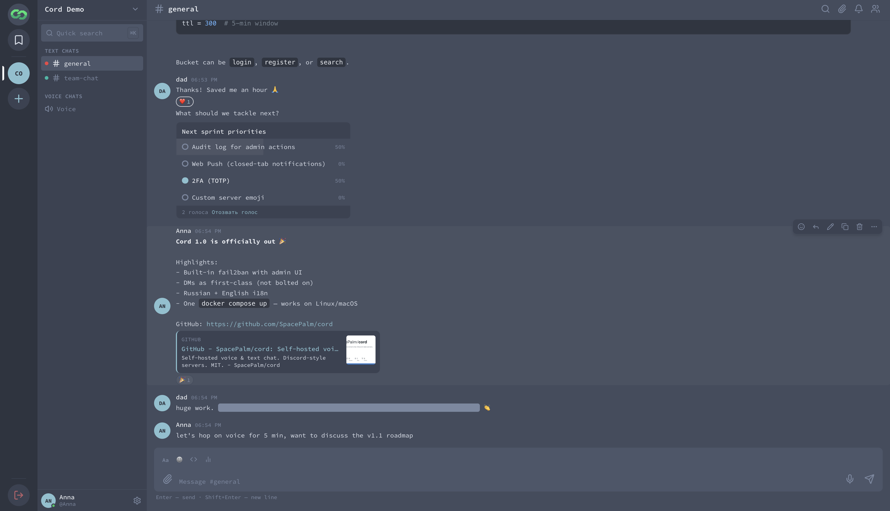
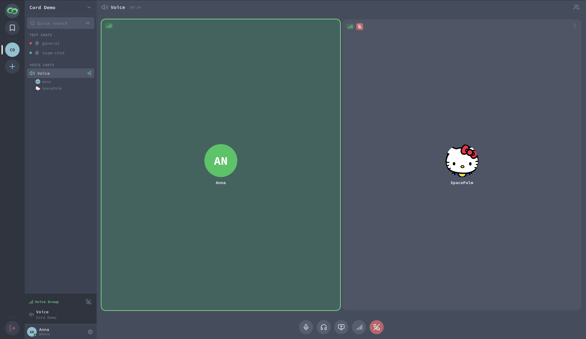
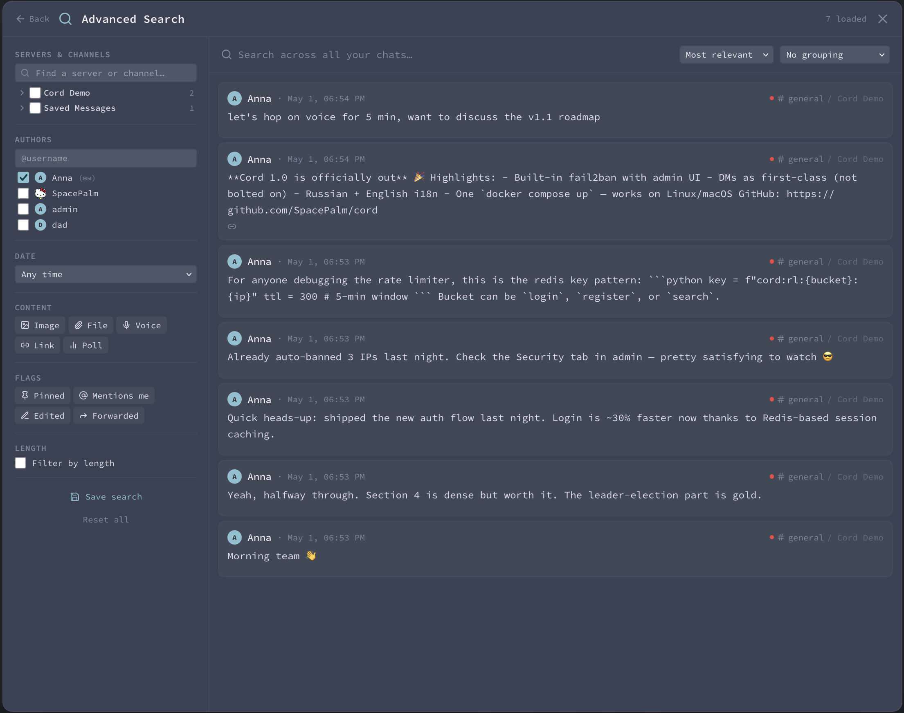
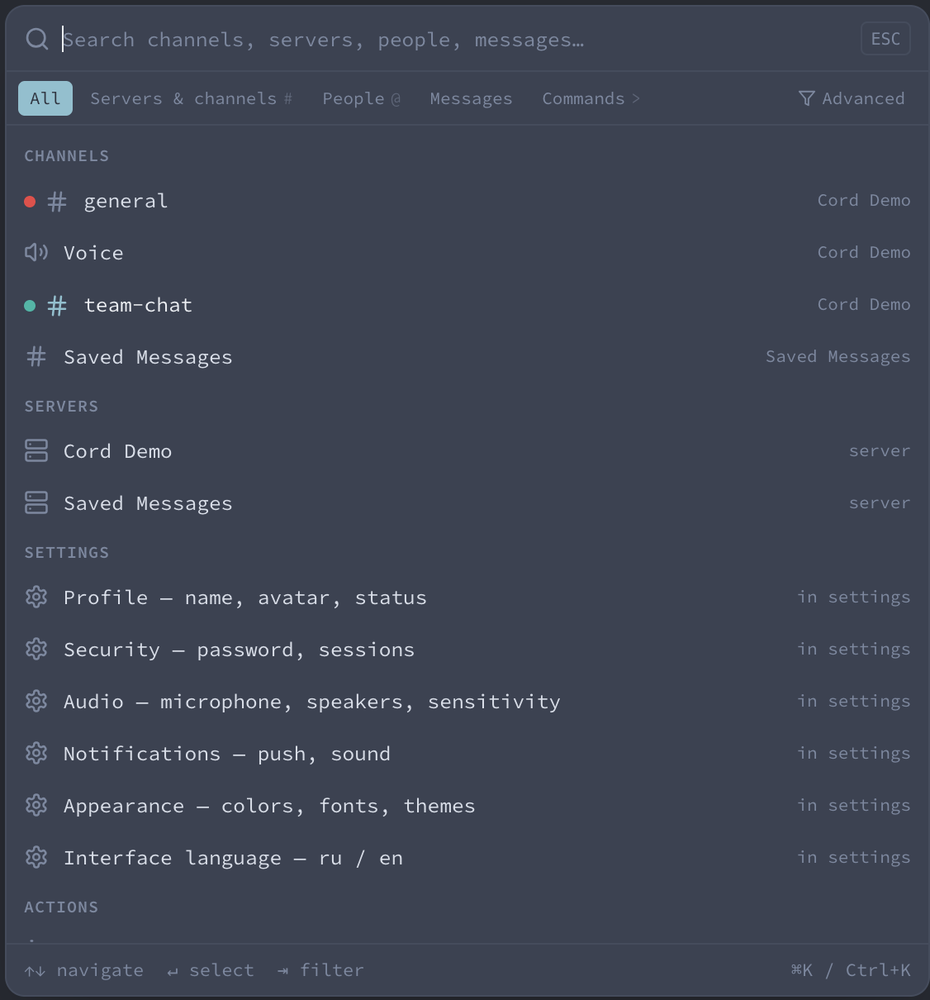
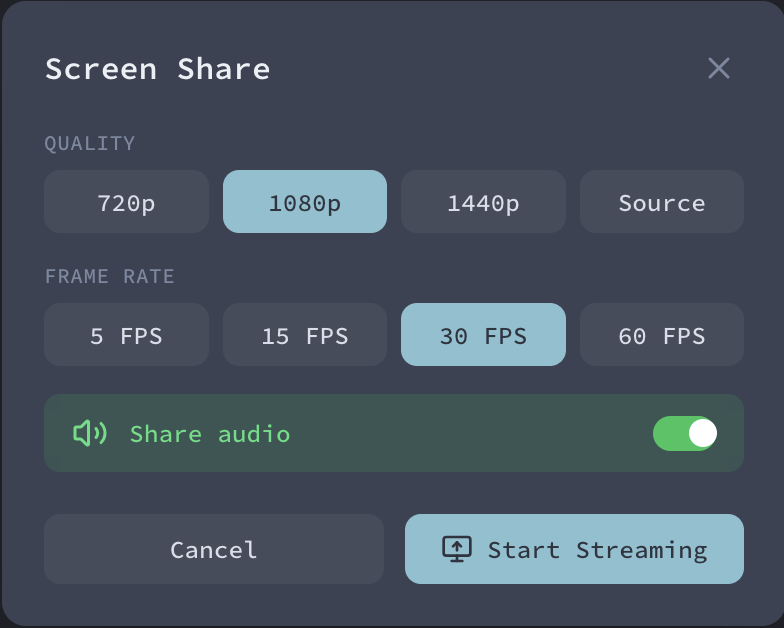
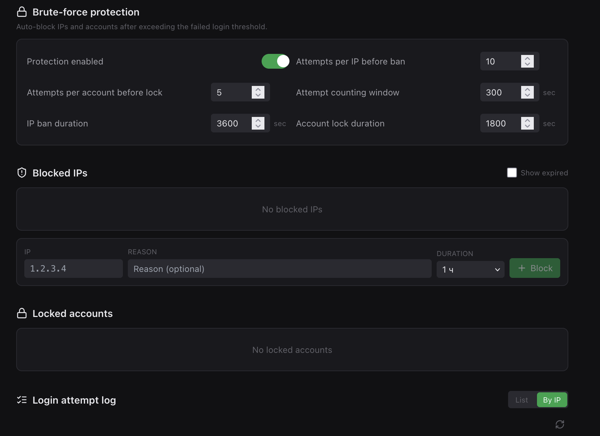
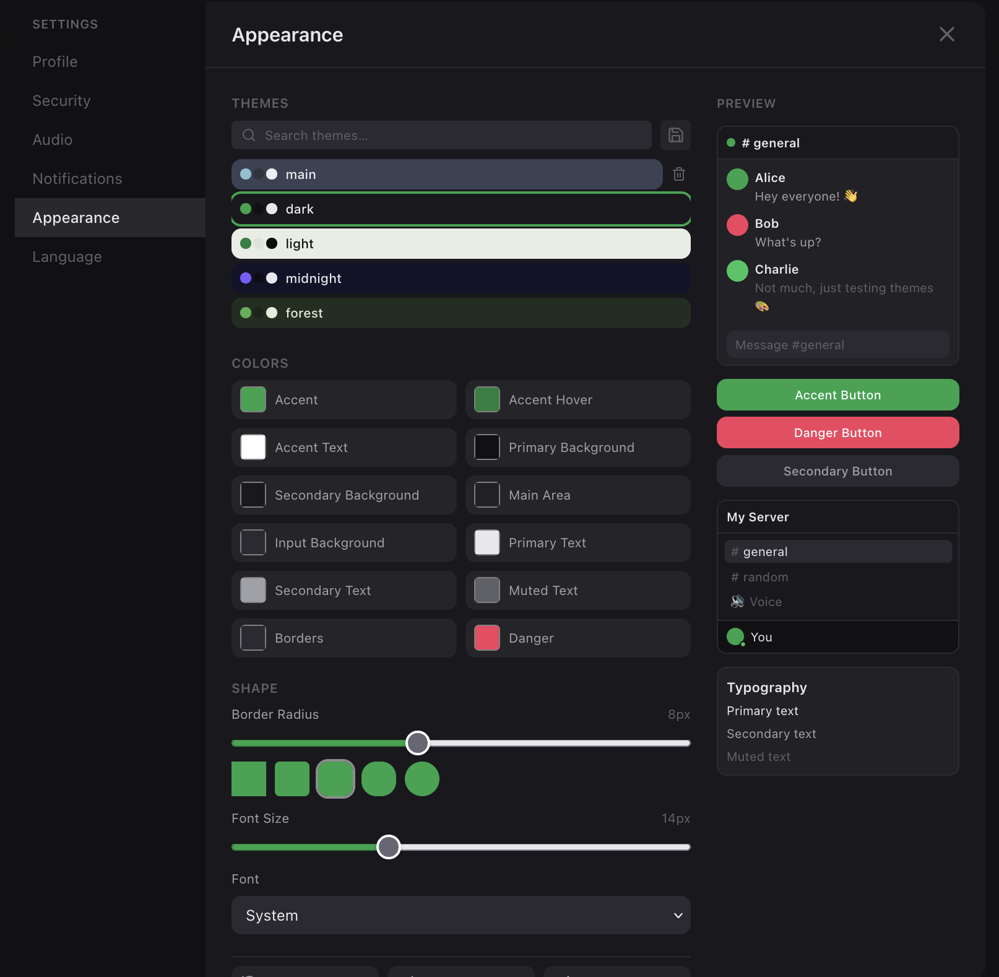

<p align="center">
  
</p>

<h1 align="center">Cord</h1>

<p align="center">
  Open-source voice, video & text chat platform — self-hosted Discord alternative.<br/>
  Built with FastAPI, React, LiveKit, PostgreSQL, and Redis.
</p>

<p align="center">
  
</p>

<p align="center"><b>Voice & video rooms</b> — LiveKit-powered, active-speaker highlight, per-user volume, camera toggle, screen sharing, focused-source layout with a resizable strip on any side</p>
<p align="center">
  
</p>

<p align="center"><b>Advanced search</b> — cross-server full-text search with filters by author, date, content type, flags</p>
<p align="center">
  
</p>

<details>
<summary><b>More screenshots</b></summary>

<p align="center"><b>Command palette</b> (<code>Ctrl/Cmd + K</code>) — jump to any channel, server, person, message, or settings tab in one keystroke</p>
<p align="center">
  
</p>

<p align="center"><b>Screen sharing</b> — pick quality (720p–1440p), framerate (5–60 FPS), and toggle system audio capture</p>
<p align="center">
  
</p>

<p align="center"><b>Built-in brute-force protection</b> — auto-ban IPs and lock accounts on failed-login thresholds, manual blocks with custom durations, attempt log grouped by IP</p>
<p align="center">
  
</p>

<p align="center"><b>Themes</b> — 120+ built-in presets, full color customization, 22 fonts, live preview</p>
<p align="center">
  
</p>

</details>

---

## What is Cord?

**Cord is your own private chat platform.** Run it on your VPS, your home server, even your laptop — and get a Discord-style space for you, your team, your friends, or your family without sending a single message to a third-party cloud.

You get **text channels, voice rooms with video and screen sharing, DM calls, and a polished modern UI** — all in one container stack you can deploy in five minutes. No accounts on a vendor service, no message scanning, no upsells. Your data, your server, your rules.

---

## What you can do

### 💬 Chat
- **Servers and channels** like Discord — group your team or community into spaces with multiple text rooms
- **Direct messages** for 1-to-1 conversations, with read receipts and unread counters
- **Rich text** — markdown (`**bold**`, `*italic*`, `||spoilers||`), code blocks with syntax highlighting, link previews
- **Replies, forwards, reactions, pinned messages, polls**
- **File attachments** — drag & drop, image preview, voice messages
- **Edit your messages** with an auto-expanding editor that fits long text
- **Search across everything** — full-text search over millions of messages in <50 ms, with Russian + English stemming

### 🎙 Voice & video calls
- **Voice rooms** in every server — join with one click, talk to as many people as you want
- **Camera on/off** — turn on video in any voice room; pick which camera to use; or **disable cameras completely** for privacy
- **Screen sharing** with configurable quality (720p / 1080p / 1440p), framerate up to 60 FPS, and system audio capture
- **Smart layout** — when someone shares a screen or turns on video, you can switch between sources by clicking, dragging, or using a side strip; the strip can sit on the bottom, top, left, or right, and resize to whatever balance you like
- **Per-user volume** — boost a quiet speaker to 300% or mute someone for yourself without affecting others
- **DM calls** with proper telephone-style flow — incoming-call overlay, ringtone, accept / decline / cancel
- **Floating call widget** — keep talking while browsing other chats; drag it anywhere
- **Connection stats** — see ping, bitrate, packet loss in real time

### 🔔 Notifications
- **Browser push** when the tab is in the background, with sender avatar and message preview
- **In-app toasts** when the tab is open
- **Smart filtering** — choose between Everything / Mentions & DMs / DMs only / Off
- **Per-chat mute** — silence noisy channels with one click
- **Separate volumes** for the new-message chime and incoming-call ring

### 🎨 Customization
- **120+ built-in themes** — Dracula, Tokyo Night, Catppuccin, Gruvbox, Solarized, Nord, Rose Pine, Monokai Pro, Material, and dozens more, plus original "Cord" themes
- **Full color customization** when you want to roll your own
- **22 fonts** including Inter, JetBrains Mono, Fira Code, Playfair, Lora
- **Adjustable border radius and font size**
- **Export / import themes as JSON** to share them
- **Two languages** out of the box — English and Russian; easily extensible

### 🔐 Security and privacy
- **Modern auth** — JWT + rotating refresh tokens with steal detection; bcrypt-hashed passwords
- **Built-in fail2ban** — auto-ban IPs and lock accounts on failed logins; the admin panel has a full UI for IP blocks, locked accounts, and attempt logs
- **Strangers can't find you** — search is Telegram-style: only your existing contacts come up by partial name, and outsiders need your exact username
- **DM protection** — direct conversations can't be deleted, renamed, or otherwise tampered with, even by admins
- **Mobile-friendly calls** — calls survive the screen turning off thanks to Wake Lock + Media Session integration

### ⚙️ Self-hosted essentials
- **One-command deploy** with Docker Compose; pre-built images on GHCR
- **Optional S3 storage** for media (works with Yandex Cloud, MinIO, AWS, etc.)
- **HTTPS** through your favourite reverse proxy or container nginx
- **Admin panel** with user management, server overview, statistics, scheduled cleanups, and the security tab

---

## What's new in this release

This release is the **voice and video overhaul**.

### 🎥 Video calls
Camera support across the entire voice stack — turn it on in any voice room, see other people's video, pick your camera from Settings → Video. You can also globally disable video (the camera button vanishes, no browser permission prompt) if you want a pure-audio setup.

### 🪟 Reimagined call layout
When someone shares a screen, the room used to show only the screen — that's it. Now there's a **focused-source layout**:

- One source — a screen share or a participant — fills the main area.
- All other sources sit in a **strip** along one edge.
- **Click, drag-and-drop, or use the side-menu** to swap which source is "main."
- The strip can be docked to the **bottom, top, left, or right** — pick what fits your monitor.
- **Drag the divider** between the main pane and the strip to balance their sizes the way you like.
- All your layout choices are remembered per device.

### 📱 Calls that don't drop when your phone screen turns off
On mobile (and especially iOS Safari), turning the screen off used to kill a call with a series of confusing "mic on/off" beeps. Now short screen-off windows are survived gracefully — Wake Lock + Media Session integration + a `disconnectOnPageLeave: false` tweak keep the call alive until iOS itself decides to shut down the tab.

### 🖥 No more "this site is recording your screen" after you leave
The browser's recording indicator used to linger for minutes after you hung up. Now we explicitly stop screen tracks on leave — the indicator disappears instantly.

### ✏️ Editing messages doesn't cramp them anymore
The edit form was a fixed two-line scrolling box — terrible for long messages. Now it auto-grows up to a comfortable height (with scroll only if the message is really long).

### 🎤 The microphone you pick is actually used
There was an old bug: Settings → Audio remembered your microphone choice but didn't actually apply it to the call. Now it does — and you can switch microphones, speakers, or cameras **mid-call** without leaving the room.

### 🧹 Quieter network
A bunch of UI actions (edit, delete, react, pin) used to fire two requests — once for the action, then again to refetch the chat. The second request is now removed; we use the response of the first one. Roughly half the API traffic on a busy chat.

For the full technical details, see [Voice & Video](docs/voice.md).

---

## Documentation

| Topic | What's inside |
|---|---|
| [Features](docs/features.md) | Full feature list grouped by Communication / Social / Search / Notifications / Admin |
| [Architecture](docs/architecture.md) | Request flow, ports, tech stack, full project tree |
| [Deployment](docs/deployment.md) | Quick Start, environment variables, reverse-proxy / TLS patterns, production checklist |
| [User Guide](docs/user-guide.md) | Day-to-day usage: chats, command palette, DMs, search, notifications, settings |
| [Voice & Video](docs/voice.md) | Calls, camera, screen sharing, focused-source layout, strip layout, DM calls, mobile behaviour |
| [Administration](docs/administration.md) | Admin panel: users, servers, system cleanup, fail2ban controls |
| [API Reference](docs/api.md) | All HTTP + WebSocket endpoints, grouped by feature |
| [Database & Caching](docs/database.md) | PostgreSQL schema, indexes, Redis key inventory |
| [Security](docs/security.md) | Auth model, fail2ban, authorization, input validation, prod checklist |
| [Customization](docs/customization.md) | Theming, internationalization, adding a new language |

---

## Quick Start

```bash
# 1. Clone (compose files + .env.example only)
git clone https://github.com/SpacePalm/cord && cd cord

# 2. Configure
cp .env.example .env
# Edit .env — at minimum set:
#   CORD_JWT_SECRET     CORD_ADMIN_PASSWORD
#   LIVEKIT_API_KEY     LIVEKIT_API_SECRET
#   SERVER_IP           (host LAN/public IP, required for voice)

# 3. Pull images and start
docker compose -f docker-compose.prod.yaml up -d

# 4. Open http://localhost:8080
```

Default admin: `admin@admin.com` / `admin123` — **change the password before exposing publicly.** Full instructions, dev mode, and TLS patterns: [docs/deployment.md](docs/deployment.md).

---

## License

MIT
